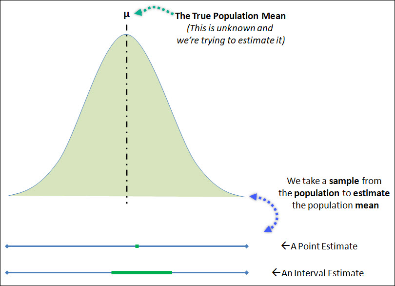

<style>
  /* Global Styles */
  body {
    font-family: 'Arial', sans-serif;
    background-color: #243E36;
    color: #F1F7ED;
    transition: background-color 1s ease;
  }

  /* Slide Styles */
  .slide {
    padding: 400px;
    background-color: #243E36;
    border-radius: 10px;
    transition: background-color 1s ease;
  }
  h1{
    color: #ffffff;
    background-color: #E0EEC6;
    border-radius: 100px;
    padding: 100px; /* Increase padding for larger background */
    text-align: center;
    margin: 20px; /* Remove any default margin */
    transition: background-color 1.0s ease;
  }

  h2, h3, h4, h5, h6 {
    color: #7CA982;
    border-radius: 100px;
    text-align: center;
    background-color: #E0EEC6;
    transition: background-color 1s ease;
  }
   h7 {
    font-size: 5; /* Adjust the font size as needed */
  }
 pre {
  font-size: 13px;
  line-height: 1;
}
}
</style>

## Introduction

- Lets understand Point Estimation in Statistics.
- We'll explore how to estimate unknown parameters from sample data.
- **Point estimators** are functions that are used to find an approximate value of a population parameter using random samples of the population.

- The size of the sample decides the accuracy of the estimate.
  - Larger the sample size the more accurate the estimate.

## Population and Sample

- **Population Parameter**: Denoted by $\theta$ (unknown)
  - Represents a characteristic of the entire population.
  - Typically unknown and needs to be estimated.
- **Sample Statistic**: Estimated by $\hat{\theta}$
  - An estimate of the population parameter.
  - Obtained from the sample data.


---

### Estimating the Mean (Eqn in Latex)

- For the sample mean $\bar{X}$, the point estimator is $\mu$.
  
- \[
  \hat{\mu} = \bar{X} = \frac{\sum_{i=1}^{n} X_i}{n}
  \]


###  Estimating Variance (Eqn in Latex)

- The point estimator for sample variance $S^2$ is $\sigma^2$.

- \[
  \hat{\sigma}^2 = S^2 = \frac{\sum_{i=1}^{n} (X_i - \bar{X})^2}{n-1}
  \]


## Distribution of Sample and its Mean 

```{r, warning=FALSE,echo=FALSE,message = FALSE,}

library(ggplot2)

set.seed(456)
sample_data <- rnorm(20, mean = 15, sd = 3)
sample_mean <- mean(sample_data)


ggplot(data.frame(Value = sample_data), aes(x = Value)) +
  geom_histogram(binwidth = 1, fill = "salmon", color = "black") +
  geom_vline(aes(xintercept = sample_mean, color = "Sample Mean"),
             linetype = "dashed", size = 1.5) +
  labs(title = "Distribution of Sample Values",
       x = "Sample Values", y = "Frequency") +
  scale_color_manual(values = c("Sample Mean" = "#ff9900"))

```
  


## Confidence Intervals (Eqn in Latex)

- Confidence intervals has a range of likely values for the estimate.

- \[
  \text{{Confidence Interval: }} \hat{\theta} \pm \text{{Margin of Error}}
  \]
<div style="text-align: center;">
  
</div>

## Point Estimate of Population Example
Lets estimate the proportion of computer owners in a certain city that use antivirus. We survey a random sample of 20 citizens.

```{r, echo=FALSE,fig.width=6, fig.height=3}
# Defining random data for the responses
data <- c('Y', 'Y', 'Y', 'N', 'N', 'Y', 'Y', 'Y', 'N', 'Y',
          'N', 'Y', 'Y', 'N', 'N', 'Y', 'Y', 'Y', 'N', 'N')

# Find total sample size
n <- length(data)

# Number who responded 'Yes'
k <- sum(data == 'Y') 

# Finding the sample proportion
p <- k/n

# Plotting bar chart to visualize the data

ggplot(data.frame(Response = data), aes(x = Response)) +
  geom_bar(fill = "salmon", color = "black") +
  labs(title = "Survey Results - Has Antivirus",
       x = "Response", y = "Frequency") +
  theme_minimal()

```

- The calculated sample proportion = 0.6


## Problem: Estimating Pollution Level

Lets estimate the average concentration of a harmful pollutant, \( \mu_{\text{pollutant}} \), in the air to implement mitigation strategies.

The first step will be to collect the data from various monitoring stations 

Then we estimate the average concentration of the pollutant based on the sample data

Lets create a 3D scatter plot and also has estimated mean concentration

## Visualization of the Data and point estimate

```{r,echo=FALSE, message=FALSE, warning=FALSE}
library(plotly)

# Creating a hypothetical dataset 
set.seed(123)
monitoring_data <- data.frame(
  Longitude = rnorm(100, mean = 12, sd = 2),
  Latitude = rnorm(100, mean = 34, sd = 1),
  Pollutant_Concentration = rnorm(100, mean = 25, sd = 5)
)

# Calculate the point estimate for average concentration
point_estimate <- mean(monitoring_data$Pollutant_Concentration)

plot_ly(monitoring_data, 
        x = ~Longitude, 
        y = ~Latitude, 
        z = ~Pollutant_Concentration,
        color = ~Pollutant_Concentration,
        size = ~Pollutant_Concentration,
        type = "scatter3d",
        mode = "markers",
        marker = list(colorbar = list(title = "Concentration"),
                      line = list(color = "red", width = 2),
                      size = 5),
        text = ~paste("Concentration: ", round(Pollutant_Concentration, 2)),
        showlegend = FALSE) %>%
  add_trace(x = mean(monitoring_data$Longitude),
            y = mean(monitoring_data$Latitude),
            z = mean(monitoring_data$Pollutant_Concentration),
            type = 'scatter3d',
            mode = 'markers',
            marker = list(color = "red", size = 7, symbol = 4),
            text = "Point Estimate") %>%
  colorbar(title = "Concentration", colors = 'Viridis') %>%
  layout(scene = list(title = "3D Scatter Plot - Pollutant Concentration Across the City",
                      xaxis = list(title = "Longitude"),
                      yaxis = list(title = "Latitude"),
                      zaxis = list(title = "Pollutant Concentration")),
         margin = list(l = 0, r = 0, b = 0, t = 0))
```

## R code for the 3D Plot Before 

```{r,echo=TRUE,message=FALSE}
library(plotly)

# Creating a hypothetical dataset 
set.seed(123)
monitoring_data <- data.frame(
  Longitude = rnorm(100, mean = 12, sd = 2),
  Latitude = rnorm(100, mean = 34, sd = 1),
  Pollutant_Concentration = rnorm(100, mean = 25, sd = 5)
)

# Calculating the point estimate for population
point_estimate <- mean(monitoring_data$Pollutant_Concentration)

plot_ly(monitoring_data, 
        x = ~Longitude, 
        y = ~Latitude, 
        z = ~Pollutant_Concentration,
        color = ~Pollutant_Concentration,
        size = ~Pollutant_Concentration,
        type = "scatter3d",
        mode = "markers",
        marker = list(colorbar = list(title = "Concentration"),
                      line = list(color = "red", width = 2),
                      size = 5),
        text = ~paste("Concentration: ", round(Pollutant_Concentration, 2)),
        showlegend = FALSE) %>%
  add_trace(x = mean(monitoring_data$Longitude),
            y = mean(monitoring_data$Latitude),
            z = mean(monitoring_data$Pollutant_Concentration),
            type = 'scatter3d',
            mode = 'markers',
            marker = list(color = "red", size = 7, symbol = 4),
            text = "Point Estimate") %>%
  colorbar(title = "Concentration", colors = 'Viridis') %>%
  layout(scene = list(title = "3D Scatter Plot - Pollutant Concentration Across the City",
                      xaxis = list(title = "Longitude"),
                      yaxis = list(title = "Latitude"),
                      zaxis = list(title = "Pollutant Concentration")),
         margin = list(l = 0, r = 0, b = 0, t = 0))
```

## Additional Related Formulas (Eqn in Latex)

### Bias of an Estimator

Bias measures the difference between the expected value of the estimator and the true parameter.

\[
\text{Bias}(\hat{\theta}) = \mathbb{E}(\hat{\theta}) - \theta
\]

### Standard Error (SE)

SE measures the variability of the estimator. It is the standard deviation of the sampling distribution of the estimator.

\[
\text{SE}(\hat{\theta}) = \sqrt{\text{Var}(\hat{\theta})}
\]
---

## Thank You!

### References

1. https://cqeacademy.com/cqe-body-of-knowledge/quantitative-methods-tools/point-estimates-and-confidence-intervals/
2. https://corporatefinanceinstitute.com/resources/data-science/point-estimators/
